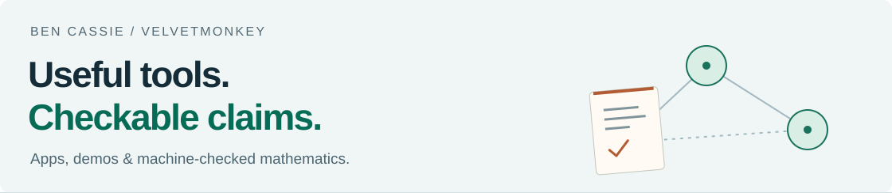

<picture>
  <source media="(prefers-color-scheme: dark)" srcset="assets/profile-dark.svg">
  <source media="(prefers-color-scheme: light)" srcset="assets/profile-light.svg">
  
</picture>

I build tools for AI-agent approvals and distributed state, then make their evidence easier to inspect. Architect working across data platforms, APIs, formal methods and AI research.

**[Apps](#start-with-the-apps) · [Demos](#try-it-see-it-break-it) · [Research](#research) · [About](#about)**

## Start with the apps

<table>
<tr>
<td width="50%" valign="top">

### [Seal](https://velvetmonkey.github.io/seal/)

**Approve the exact tool call. Keep the receipt.**

A local MCP approval gate for Claude Code. Inspect the proposed call, approve it at most once, and get a signed decision receipt. Seal refuses calls that drift from what you approved. It is a gate, not a sandbox.

**[Get started →](https://velvetmonkey.github.io/seal/start/install/)** · [Source](https://github.com/velvetmonkey/seal)

[Check a receipt in your browser](https://velvetmonkey.github.io/seal-check/) · [Review the evidence with the CLI](https://github.com/velvetmonkey/seal-assurance-kit)

</td>
<td width="50%" valign="top">

### [SafeMesh](https://velvetmonkey.github.io/safemesh/)

**Make local edits. Bring replicas back together.**

A Rust CRDT core with language bindings for merging distributed state. Explore counters and set membership, save and restart replicas, then exchange their state. You bring the transport and application schema.

**[Open the Lab →](https://velvetmonkey.github.io/safemesh/lab/)** · [Docs](https://velvetmonkey.github.io/safemesh/) · [Source](https://github.com/velvetmonkey/safemesh)

[Start with Rust or TypeScript](https://velvetmonkey.github.io/safemesh/getting-started/). Source builds; `main` is unreleased.

</td>
</tr>
</table>

**The Seal family:** [seal](https://github.com/velvetmonkey/seal) gates calls; [seal-check](https://github.com/velvetmonkey/seal-check) checks supported receipts locally in your browser; [seal-assurance-kit](https://github.com/velvetmonkey/seal-assurance-kit) makes the kernel's evidence runnable from a CLI. Separate tools let you inspect the product's claims from outside it, with shared kernel and format dependencies still in scope. Checking a receipt does not establish that the recorded tool effect happened.

**Also in the toolbox:** [collision-check](https://github.com/velvetmonkey/collision-check) finds counterexamples to observational claims within a declared finite or sampled space. [Roundtable](https://github.com/velvetmonkey/roundtable) coordinates AI CLI assistants through a local MCP server.

## Try it, see it, break it

| Open a demo | What to explore |
| --- | --- |
| **[SafeMesh Lab →](https://velvetmonkey.github.io/safemesh/lab/)** | Make independent edits, exchange state and watch replicas merge. Runs the Rust core through WASM. |
| **[Seal receipt checker →](https://velvetmonkey.github.io/seal-check/)** | Paste a supported receipt and inspect the result locally. Start with the [example receipts](https://github.com/velvetmonkey/seal-check/tree/master/examples). |
| **[Coordination Kernel →](https://velvetmonkey.github.io/flywheel-universe/coordination-kernel.html)** | Explore a numerical illustration of Kuramoto synchronisation, with theorem conditions and counterfactuals. The simulator itself is not verified. |
| **[Hebbian–Kuramoto playground →](https://velvetmonkey.github.io/flywheel-universe/)** | Change topology, coupling and perturbations in an interactive research demo. |

Prefer a terminal? Follow [Seal's approval walkthrough](https://github.com/velvetmonkey/seal#what-you-should-see) or [SafeMesh's partition-and-heal example](https://velvetmonkey.github.io/safemesh/examples/#rust-partition-and-heal).

## Research

Alongside the apps I keep a machine-checked Lean 4 proof corpus on optimisation, learning, dynamics and distributed systems. It has its own index, with the repositories, theorem statements and current status: **[Lean index →](https://velvetmonkey.github.io/lean/)**. More about me and the research is on [my website](https://velvetmonkey.github.io/).

### Experiments that can say no

[Witness Lab](https://github.com/velvetmonkey/witness-lab) tests whether local witness information helps neural models on synthetic tasks. Most of the broad hypotheses did not survive. The remaining positive result is narrowly scoped; the [retrospective](https://github.com/velvetmonkey/witness-lab/blob/master/RETROSPECTIVE.md) explains what held up and what did not.

## What “checked” means here

**Claims need receipts.** Lean proofs concern their stated models. Tests, finite conformance checks, numerical demos and deployed software each have a different scope. I keep those distinctions visible, including what remains assumed or unfinished.

For the apps, start with [Seal's guarantees and non-guarantees](https://github.com/velvetmonkey/seal#guarantees-and-non-guarantees) and [SafeMesh's proof boundary](https://velvetmonkey.github.io/safemesh/proof/).

## About

I'm Ben Cassie, **velvetmonkey**. My background is in ESG data platforms and API architecture; my current work brings practical tools, AI research and formal methods together.

[Website](https://velvetmonkey.github.io/) · [ORCID](https://orcid.org/0009-0004-1899-7627) · [@thevelvetmonke](https://x.com/thevelvetmonke)
